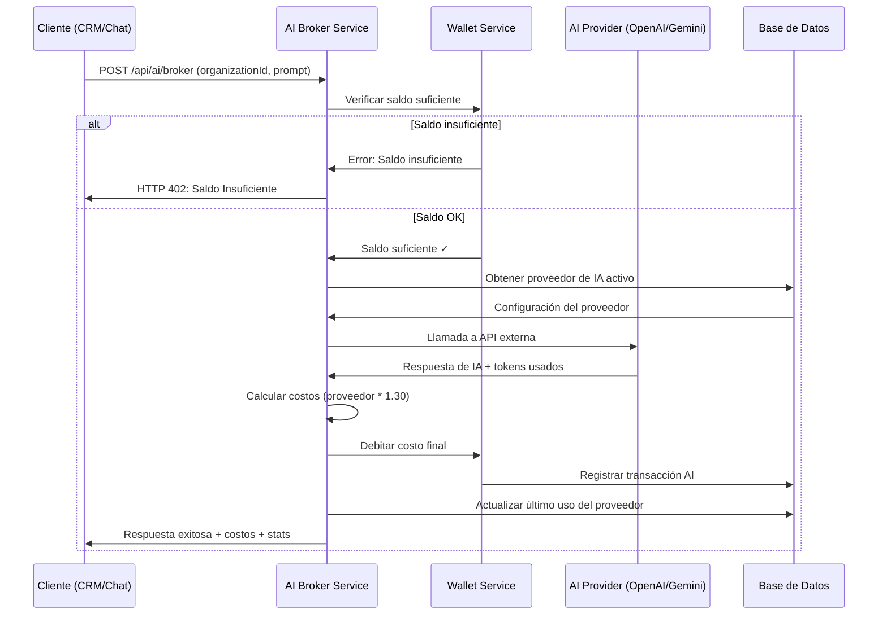

# AI Broker Service - Arquitectura y Flujo

## Visión General

El AI Broker Service actúa como el **único punto de entrada** para todas las solicitudes de IA en la plataforma COMODÍN IA. Este servicio centraliza:

- ✅ Verificación de saldo de billetera
- ✅ Selección automática de proveedores
- ✅ Llamadas a APIs externas (OpenAI, Gemini, etc.)
- ✅ Cálculo automático de costos con margen
- ✅ Débito automático de billetera
- ✅ Registro completo de transacciones
- ✅ Manejo de errores y reintentos

## Arquitectura del Sistema

```
┌─────────────────┐    ┌──────────────────┐    ┌─────────────────┐
│   CRM Module    │    │   Chat System    │    │  Other Modules  │
│                 │    │                  │    │                 │
│ - Customer Supp.│    │ - WhatsApp Bot   │    │ - Analytics     │
│ - Email System  │    │ - Live Chat      │    │ - Reports       │
│ - Lead Mgmt     │    │ - Automated Resp │    │ - Integrations  │
└─────────┬───────┘    └────────┬─────────┘    └────────┬────────┘
          │                     │                       │
          │                     │                       │
          └─────────────────────┼───────────────────────┘
                                │
                    ┌───────────▼────────────┐
                    │                        │
                    │   AI Broker Service    │
                    │                        │
                    │  /api/ai/broker        │
                    │                        │
                    └───────────┬────────────┘
                                │
          ┌─────────────────────┼─────────────────────┐
          │                     │                     │
          ▼                     ▼                     ▼
┌─────────────────┐   ┌─────────────────┐   ┌─────────────────┐
│   Wallet Mgmt   │   │  AI Providers   │   │   Transaction   │
│                 │   │                 │   │    Logging      │
│ - Balance Check │   │ - OpenAI        │   │                 │
│ - Auto Debit    │   │ - Gemini        │   │ - Usage Stats   │
│ - Low Alert     │   │ - Claude        │   │ - Cost Tracking │
│ - Recharge      │   │ - Custom APIs   │   │ - Audit Trail   │
└─────────────────┘   └─────────────────┘   └─────────────────┘
```

## Flujo de Procesamiento

### Paso a Paso del AI Broker



## Componentes del Sistema

### 1. AI Broker Service (`/lib/ai-broker-service.ts`)

**Responsabilidades principales:**
- Orquestar todo el flujo de procesamiento
- Validar solicitudes entrantes
- Seleccionar proveedor apropiado
- Manejar llamadas a APIs externas
- Calcular costos finales
- Registrar métricas y estadísticas

**Métodos principales:**
```typescript
AIBrokerService.processAIRequest(request)     // Método principal
AIBrokerService.getBrokerStats()              // Estadísticas globales
```

### 2. AI Broker Client (`/lib/ai-broker-client.ts`)

**Responsabilidades:**
- Proporcionar interfaz simple para otros módulos
- Manejar diferentes tipos de solicitudes IA
- Abstraer complejidades de la API
- Proveer utilidades comunes

**Métodos principales:**
```typescript
aiBroker.chat(orgId, message, options)        // Chat/conversación
aiBroker.analyzeSentiment(orgId, text)        // Análisis sentimiento
aiBroker.generateContent(orgId, prompt)       // Generación contenido
aiBroker.translate(orgId, text, language)     // Traducción
aiBroker.summarize(orgId, text)               // Resumen
```

### 3. API Endpoints

**Endpoint principal:** `POST /api/ai/broker`
```json
{
  "organizationId": "org_123",
  "prompt": "¿Cuáles son nuestros productos más vendidos?",
  "usageType": "CHAT_RESPONSE",
  "userId": "user_456",
  "userName": "María González",
  "temperature": 0.7,
  "maxTokens": 200
}
```

**Endpoint de estadísticas:** `GET /api/ai/broker`

**Endpoint de testing:** `POST /api/ai/broker/test`

## Integración con Servicios Existentes

### Wallet Service
- **Verificación de saldo:** Antes de cada solicitud
- **Débito automático:** Después de respuesta exitosa
- **Cálculo de margen:** 30% sobre costo del proveedor
- **Registro financiero:** Transacción completa en historial

### AI Providers Management
- **Selección automática:** Proveedor por defecto o más apropiado
- **Gestión de claves:** Descifrado seguro de API keys
- **Configuración flexible:** Precios, límites, modelos
- **Monitoreo de uso:** Última vez usado, estadísticas

### Transaction Logging
- **Registro completo:** Cada solicitud se registra
- **Métricas detalladas:** Tokens, tiempo, costos, errores
- **Auditoria:** Quién, qué, cuándo, cuánto costó
- **Analytics:** Estadísticas de uso por organización

## Proveedores Soportados

### 1. OpenAI
- **Endpoint:** `https://api.openai.com/v1/chat/completions`
- **Modelos:** GPT-3.5-turbo, GPT-4, etc.
- **Pricing:** Configurado por input/output tokens

### 2. Google Gemini
- **Endpoint:** `https://generativelanguage.googleapis.com/v1/models/{model}:generateContent`
- **Modelos:** gemini-pro, gemini-pro-vision
- **Pricing:** Configurado por input/output tokens

### 3. Extensible para otros proveedores
- Claude (Anthropic)
- Cohere
- APIs personalizadas

## Configuración y Seguridad

### Encriptación de Claves
- **Algoritmo:** AES-256-GCM
- **Gestión:** Solo Super Admin puede gestionar
- **Storage:** Claves encriptadas en base de datos
- **Acceso:** Descifrado on-demand para uso

### Control de Acceso
- **Permisos:** `USE_AI_BROKER` requerido
- **Roles:** PROPIETARIO, AGENTE, DISTRIBUIDOR
- **Aislamiento:** Por organización (multi-tenant)

### Monitoreo y Alertas
- **Rate Limiting:** Configurable por proveedor
- **Error Handling:** Reintentos automáticos
- **Alertas:** Saldo bajo, errores frecuentes
- **Métricas:** Tiempo respuesta, tasa de éxito

## Escalabilidad y Performance

### Optimizaciones
- **Caché de configuración:** Proveedores activos en memoria
- **Pool de conexiones:** Reutilización de conexiones HTTP
- **Procesamiento asíncrono:** No bloquea otras operaciones
- **Batch processing:** Futuro soporte para múltiples solicitudes

### Límites y Quotas
- **Por organización:** Límites de uso mensual
- **Por usuario:** Rate limiting configurable
- **Por proveedor:** Respeto a límites de API externa
- **Global:** Monitoreo de recursos del sistema

